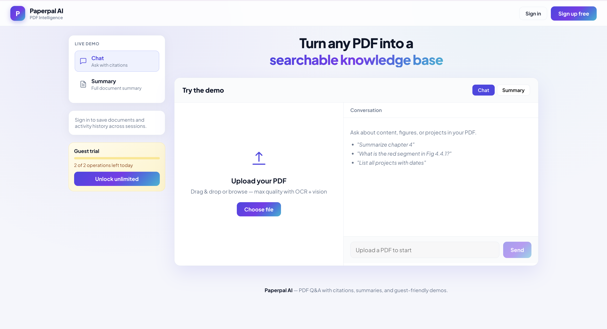
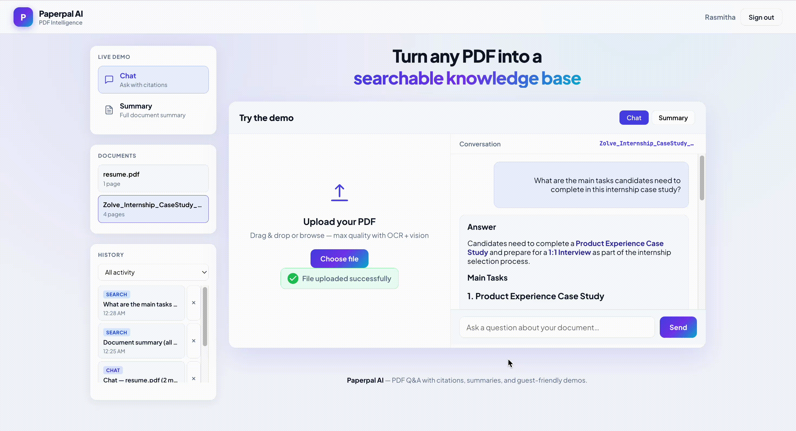
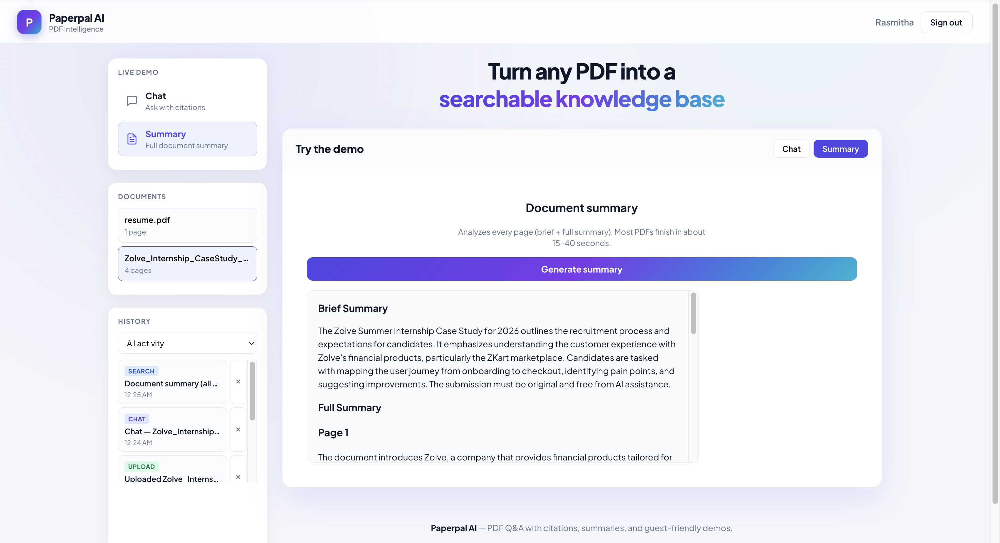

# Paperpal AI

Paperpal AI is a full-stack PDF question-answering app that lets users upload PDFs, ask document-based questions, and generate summaries with page-level sources.

The app uses a RAG pipeline with vector search, OCR, table extraction, and vision-based chart processing to make PDFs easier to search and understand.

---

## What this project does

Paperpal AI helps users work with long or scanned PDFs without manually reading every page. Users can upload a document, ask questions, view grounded answers with sources, and generate a brief or detailed summary.

The system is designed to reduce unsupported answers by retrieving relevant PDF chunks before generating a response.

---

## Features

- Upload PDFs and index them into a document-specific vector database
- Ask questions and receive answers grounded in the uploaded PDF
- Show page-level sources used for each answer
- Generate brief and detailed full-document summaries
- Extract native PDF text, tables, scanned text, and chart/figure descriptions
- Support user accounts with saved documents and activity history
- Provide guest trial usage with daily operation limits

---

## Tech stack

| Area | Technologies |
|------|--------------|
| Frontend | React 18, Vite, Marked |
| Backend | FastAPI, Uvicorn, Pydantic Settings |
| RAG / LLM | LangChain, OpenAI GPT models, OpenAI Embeddings |
| Vector database | Pinecone, langchain-pinecone |
| PDF processing | PyMuPDF, pdfplumber, Tesseract OCR, GPT-4o-mini Vision |
| Auth and storage | JWT, SQLite, bcrypt/passlib |
| Development | Python 3.9+, Node.js 18+ |

---

## How PDF processing works

### Upload flow

- Saves uploaded PDFs under `data/uploads/`
- Extracts native PDF text using PyMuPDF
- Uses OCR fallback for scanned or low-text pages
- Extracts tables with pdfplumber
- Uses vision processing for chart-heavy or figure-heavy pages
- Splits extracted content into page-aware chunks with metadata
- Stores embeddings in Pinecone with `doc_id`, `page`, and `chunk_id`

### Question-answering flow

- Embeds the user question
- Searches Pinecone using document-specific filtering
- Retrieves the most relevant PDF chunks
- Applies similarity filtering before answer generation
- Uses a LangChain QA chain to generate a Markdown response
- Returns the answer with page-level sources

### Summary flow

- Reads every page from the stored PDF
- Generates a brief summary and a detailed page-level summary
- Uses batched summarization for larger documents
- Exposes summary generation through `POST /api/summary`

---

## What I built

- Built an end-to-end PDF RAG workflow for upload, indexing, question answering, and summarization
- Implemented document-scoped vector search using Pinecone and OpenAI embeddings
- Added OCR, table extraction, and vision-generated chart descriptions during ingestion
- Created FastAPI routes for upload, query, summary, authentication, document history, and activity history
- Built a React + Vite frontend with upload, chat, summary, authentication, and history views
- Added guest usage limits and signed-in user access for saved documents and unlimited usage

---

## Screenshots

### Upload and guest trial 



### Chat with sources 




### Summary result 

 
---

## Project structure

```text
pdf-rag-assistant/
├── backend/              # FastAPI app, API routes, auth, RAG, PDF processing
├── frontend/             # React + Vite frontend
├── data/                 # Local uploads, registry, and SQLite DB (gitignored)
├── requirements.txt      # Python dependencies
├── .env.example          # Example environment variables
└── README.md
```
---

## Running locally

### Prerequisites

- Python 3.9+
- Node.js 18+
- Pinecone account and API key
- OpenAI API key
- Optional: Tesseract OCR for scanned PDFs

### 1. Clone and configure

```bash
git clone <your-repo-url>
cd pdf-rag-assistant

python3 -m venv .venv
source .venv/bin/activate

pip install -r requirements.txt
cp .env.example .env
```

Update `.env` with your keys:

```env
OPENAI_API_KEY=sk-...
PINECONE_API_KEY=pcsk-...
PINECONE_INDEX_NAME=your-index-name
JWT_SECRET=your-long-random-secret

PINECONE_SKIP_INDEX_BOOTSTRAP=true
SUMMARY_MODEL=gpt-4o-mini
```

### 2. Run the backend

```bash
uvicorn backend.main:app --reload --port 8000
```
---

### 3. Run the frontend

```bash
cd frontend
npm install
npm run dev
```

Open the app:

```text
http://localhost:5173
```

---


## Environment variables

Create a `.env` file using `.env.example`.

```env
OPENAI_API_KEY=
PINECONE_API_KEY=
PINECONE_INDEX_NAME=
JWT_SECRET=
PINECONE_SKIP_INDEX_BOOTSTRAP=true
SUMMARY_MODEL=gpt-4o-mini
```

Do not commit your real `.env` file.

---

## Next steps

- Add summary caching per `doc_id`
- Stream chat and summary responses in the UI
- Add PDF highlight and jump-to-page support from sources
- Export summaries and chat transcripts as PDF or Markdown
